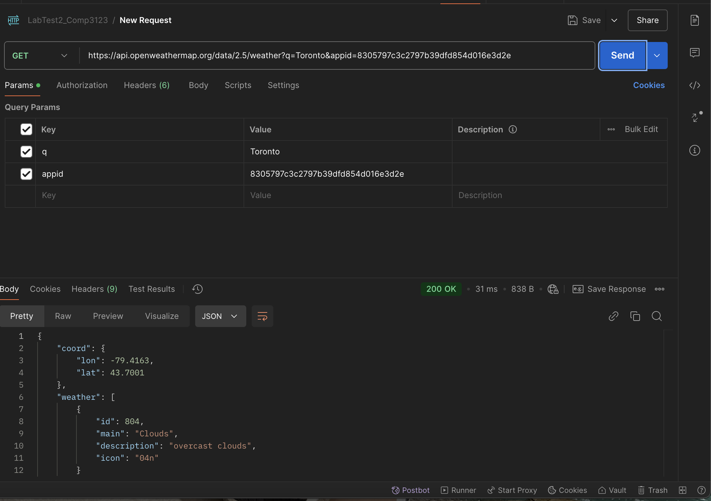

# Weather App - Lab Test 2

## Introduction
This Weather App provides current weather data and a 5-day forecast for a user-specified location. The application dynamically updates the background based on the weather condition (e.g., sunny, cloudy, rainy) and offers a detailed 3-hour forecast when clicking on any day in the 5-day forecast.

## Features
- **Current Weather Display**: Shows the temperature, weather condition, humidity, and wind speed for the selected city.
- **5-Day Forecast**: Displays weather data for the next five days, including temperature and weather icons.
- **3-Hour Forecast**: Detailed forecast for the selected day.
- **Dynamic Backgrounds**: Updates based on weather conditions.
- **Responsive Design**: Adjusts to various screen sizes.

## How to Run the Application
1. Clone the repository:
   ```bash
   git clone <repository-url>
   ```
2. Navigate to the project directory:
   ```bash
   cd weather-app
   ```
3. Install dependencies:
   ```bash
   npm install
   ```
4. Start the development server:
   ```bash
   npm start
   ```
5. Open `http://localhost:3000` in your web browser.

## API Usage
The app uses the OpenWeatherMap API for weather data. To use the app:
1. Sign up for an API key at [OpenWeatherMap](https://openweathermap.org/).
2. Replace the `API_KEY` variable in the `Weather.js` file with your own API key.

## Postman Usage
To verify API responses:
1. Set up Postman and create a GET request with the URL:
   ```
   https://api.openweathermap.org/data/2.5/weather?q={CITY_NAME}&appid={YOUR_API_KEY}&units=metric
   ```
2. Replace `{CITY_NAME}` with the desired city and `{YOUR_API_KEY}` with your API key.
3. Refer to the screenshots below for example Postman results.

## Outputs

### Weather App Screenshots 
#### Cloudy:


#### Rainy:


#### Sunny:


#### Weather App 3 Hour forecast when clicking “Click for more details”:


### Postman Screenshots
#### Part 1


#### Part 2


## Technologies Used

- **React**: Front-end library for building user interfaces.
- **Material-UI**: Styling and component library for React.
- **Axios**: HTTP client for making API requests.
- **OpenWeatherMap API**: Provides weather data.


---

## Credits
Developed for Lab Test 2 as part of the coursework.

## License
This project is licensed under the MIT License.
